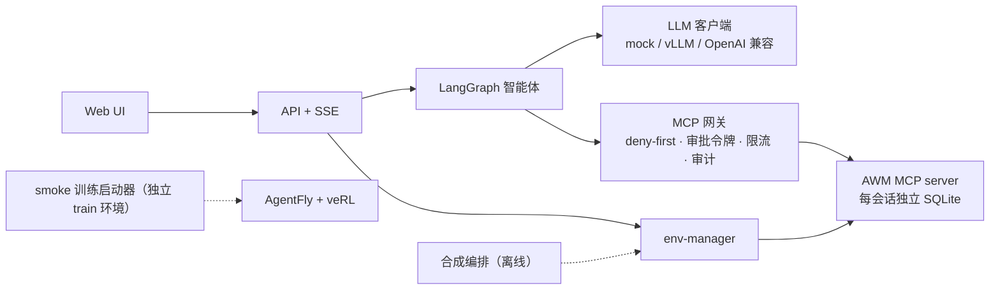

# BizAgent Workbench

> **English summary.** BizAgent Workbench is an application/engineering layer around Snowflake-Labs/agent-world-model (AWM) and Agent-One-Lab/AgentFly.
> It runs isolated AWM MCP environments per session, puts every tool call behind a deny-first MCP gateway with one-time approval tokens and audit logs, and drives them with a LangGraph agent, an HTTP/SSE API and a small web UI.
> It also orchestrates AWM's synthesis pipeline (dry-run by default) and a smoke-only training launcher in a separate environment.
> Everything runs on CPU with a scripted mock LLM; GPU serving and training are provided as scripts and marked UNVERIFIED-LOCAL.
> This repository produces no model performance numbers: paper numbers live only in `results/registry.yaml`, and the application layer has never been benchmarked.

**一句话定位**：把 AWM 的合成环境与 AgentFly 的训练框架，组织成一个可部署、可审计、可演示的企业 MCP 智能体工作台。只改"怎么用、怎么部署、怎么管、怎么看"，不改"模型有多强"。

> ⚠️ **上游许可证声明**：Snowflake-Labs/agent-world-model **未声明任何许可证**。本仓库只以 git submodule 指针引用它，不包含其代码副本，也不修改其代码；本仓库**不对 AWM 代码授予任何权利**。使用前请自行判断（详见 [docs/UPSTREAM.md](docs/UPSTREAM.md)、ADR-003）。

## 架构



分层图与"一次带审批的写操作"时序图见 [docs/ARCHITECTURE.md](docs/ARCHITECTURE.md)。

## 3 分钟快速开始（mock，CPU）

前置：Linux 或 macOS、`git`、[uv](https://docs.astral.sh/uv/)、Python 3.12（uv 可自动安装）。

```bash
git clone --recurse-submodules <this-repo> && cd <this-repo>   # 或克隆后执行 make setup 初始化子模块
make setup        # app 环境 + 迷你夹具
make doctor       # 缺少官方数据集、没有 GPU 只会给出 warn
make test         # 单元 + 集成测试（真实 AWM 代码 + mock LLM）
make demo-mock    # 打开 http://127.0.0.1:8080/ui/
```

在 UI 中：Start isolated session → 发送 "Add the best wireless noise cancelling headphones under $200 to my cart" → 在审批面板点 Approve → 查看 Timeline 与 DB diff（`cart_items` 新增一行）。

mock 的回答来自手写脚本 `tests/fixtures/trajectories/demo_query_write_approve.jsonl`，**不是模型输出**。

命令行版本：

```bash
WORKBENCH_LLM__MOCK_FIXTURE=tests/fixtures/trajectories/demo_query_write_approve.jsonl \
uv run workbench agent run --scenario mini_e_commerce --dataset-dir tests/fixtures/awm_mini --approve auto \
  "Add the best wireless noise cancelling headphones under \$200 to my cart"
```

完整学习路线见 [docs/WALKTHROUGH.md](docs/WALKTHROUGH.md)。

## GPU 部署路径（UNVERIFIED-LOCAL）

以下步骤需要 CUDA GPU 与 `huggingface.co` 访问，本仓库的开发沙箱无法验证（见 [docs/LIMITATIONS.md](docs/LIMITATIONS.md)）。

1. 数据：`make data`（下载 AgentWorldModel-1K 到 `data/awm1k/`，不入库；下载前请阅读其许可证）。
2. 模型服务：`scripts/serve_vllm.sh`（参数来自 `configs/serving/arctic-awm-4b.yaml`，可先用 `uv run workbench serve vllm-cmd` 查看）。
3. 应用：`WORKBENCH_LLM__BACKEND=vllm uv run workbench api serve`；或 `docker compose --profile gpu up`（env-manager、app、vllm 三个服务）。
4. 训练（仅 smoke）：初始化 AgentFly 的嵌套 `verl` 子模块 → `cd train && uv sync` → `uv run workbench train preflight` → `uv run workbench train launch --execute`。产物目录标记 `NO_RESULTS`，不得用于任何效果结论。

## 与上游的关系

| 上游 | 位置 | 用途 | 许可证 |
|---|---|---|---|
| Snowflake-Labs/agent-world-model | `third_party/agent-world-model` @85e322f | 环境建库、MCP server、合成 CLI | **无** |
| Agent-One-Lab/AgentFly | `third_party/AgentFly` @1256586 | 只在独立 train 环境中使用 | Apache-2.0 |
| Agent-One-Lab/verl（AgentFly 嵌套） | 默认不初始化 | smoke 训练 | Apache-2.0 |

- 上游只以固定 SHA 的 submodule 引用，从未修改（`patches/` 为空）。
- 自有代码全部在 `src/workbench/`。
- 文件级边界与许可证详见 [docs/UPSTREAM.md](docs/UPSTREAM.md)；上游事实与行号详见 [docs/RECON.md](docs/RECON.md)。

## 结果说明

本仓库**不产生任何模型性能数字**，也没有对应用层做过效果评测（ADR-013）。论文报告的数字只登记在 `results/registry.yaml`，由它生成 [docs/RESULTS.md](docs/RESULTS.md)。那些数字是论文报告值，由官方模型在官方评测 harness 上测得，不是本仓库应用层的测量结果；目前全部标注为"待核对"。

`make check-numbers` 会拦截 README 与 docs 中未登记的性能类数字。

## 文档索引

- [docs/ARCHITECTURE.md](docs/ARCHITECTURE.md)：分层图与时序图
- [docs/WALKTHROUGH.md](docs/WALKTHROUGH.md)：学习路线（环境 → 合成 → 服务 → 网关 → 智能体 → 训练）
- [docs/DECISIONS.md](docs/DECISIONS.md)：架构决策记录（ADR）
- [docs/UPSTREAM.md](docs/UPSTREAM.md)：上游边界与许可证
- [docs/LIMITATIONS.md](docs/LIMITATIONS.md)：未验证项与已知限制
- [docs/RECON.md](docs/RECON.md)：上游侦察报告
- [docs/RESULTS.md](docs/RESULTS.md)：论文数字（自动生成）
- [TASK.md](TASK.md)、[CLAUDE.md](CLAUDE.md)：任务书与工作守则
