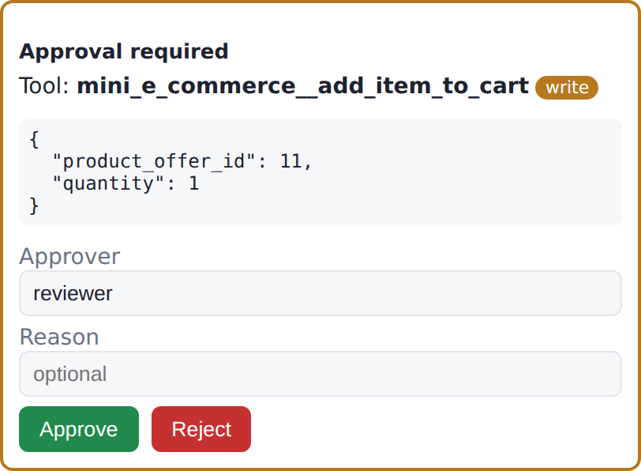
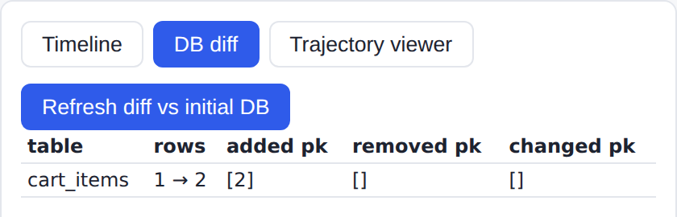
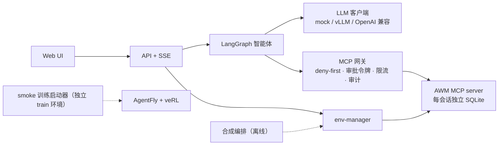

# BizAgent Workbench

[](https://github.com/IntheFesh/Agent2/actions/workflows/ci.yml?query=branch%3Amain)
[](https://github.com/IntheFesh/Agent2/actions/workflows/docker-smoke.yml?query=branch%3Amain)

> **English summary.** BizAgent Workbench is an application/engineering layer around Snowflake-Labs/agent-world-model (AWM) and Agent-One-Lab/AgentFly.
> It runs isolated AWM MCP environments per session, puts every tool call behind a deny-first MCP gateway with one-time approval tokens and audit logs, and drives them with a LangGraph agent, an HTTP/SSE API and a small web UI.
> It also orchestrates AWM's synthesis pipeline (dry-run by default) and a smoke-only training launcher in a separate environment.
> Everything runs on CPU with a scripted mock LLM; GPU serving and training come as scripts plus a step-by-step runbook, still marked UNVERIFIED-LOCAL.
> This repository produces no model performance numbers: paper numbers live only in `results/registry.yaml` (checked against arXiv 2602.10090 v3), and the application layer has never been benchmarked.

- **本仓库做了什么**：把 AWM 的合成环境组织成可部署、可审计、可演示的企业 MCP 智能体工作台——每会话隔离的环境、deny-first 的 MCP 网关（一次性审批令牌、限流、审计）、LangGraph 智能体、HTTP/SSE API 与 Web UI，外加合成编排与 smoke 训练启动器。
- **上游提供了什么**：AWM 提供环境建库、MCP server 与合成 CLI，AgentWorldModel-1K 提供官方场景，Arctic-AWM 提供模型，AgentFly 与 veRL 提供训练框架。
- **边界**：只改"怎么用、怎么部署、怎么管、怎么看"，不改"模型有多强"，不产生模型性能数字；上游只以固定 SHA 的 submodule 引用、从未修改，文件级边界与许可证见 [docs/UPSTREAM.md](docs/UPSTREAM.md)。

<p>
  
  
</p>

*mock 演示截图*：左为写操作 `add_item_to_cart` 的审批卡片，右为批准后与初始数据库比较的 DB diff（`cart_items` 新增一行）。回答来自手写的 mock 脚本，不是模型输出；截图由 `scripts/demo_ui_check.py` 在 `make demo-mock` 上生成。

> ⚠️ **上游许可证声明**：Snowflake-Labs/agent-world-model **未声明任何许可证**。本仓库只以 git submodule 指针引用它，不包含其代码副本，也不修改其代码；本仓库**不对 AWM 代码授予任何权利**。使用前请自行判断（详见 [docs/UPSTREAM.md](docs/UPSTREAM.md)、ADR-003）。

## 架构



分层图与"一次带审批的写操作"时序图见 [docs/ARCHITECTURE.md](docs/ARCHITECTURE.md)。

## 3 分钟快速开始（mock，CPU）

前置：Linux 或 macOS、`git`、[uv](https://docs.astral.sh/uv/)、Python 3.12（uv 可自动安装）。

```bash
git clone https://github.com/IntheFesh/Agent2.git && cd Agent2
make setup        # 两个顶层子模块（不递归，嵌套的 verl 与 mcp-adapted-bench 保持未初始化）+ app 环境 + 迷你夹具
make doctor       # 缺少官方数据集、没有 GPU 只会给出 warn
make test         # 单元 + 集成测试（真实 AWM 代码 + mock LLM）
make demo-mock    # 打开 http://127.0.0.1:8080/ui/
```

在 UI 中：Start isolated session → 发送 "Add the best wireless noise cancelling headphones under $200 to my cart" → 在审批面板点 Approve → 查看 Timeline 与 DB diff（`cart_items` 新增一行）。

mock 的回答来自手写脚本 `tests/fixtures/trajectories/demo_query_write_approve.jsonl`，**不是模型输出**。

命令行版本：

```bash
WORKBENCH_LLM__MOCK_FIXTURE=tests/fixtures/trajectories/demo_query_write_approve.jsonl \
uv run workbench agent run --scenario mini_e_commerce --dataset-dir tests/fixtures/awm_mini --approve auto \
  "Add the best wireless noise cancelling headphones under \$200 to my cart"
```

Docker 版本（CPU、mock LLM）：需要 Docker 与 Compose v2，并且检出目录中不能已有 `./data` 与 `.env`。

```bash
python3 scripts/docker_smoke.py   # 构建 → 启动 env-manager 与 app → 经 HTTP API 走一遍上面的演示 → 停止
```

GitHub Actions 的 docker-smoke 任务在每次 push 到 `main`、`phase9-verification` 与本轮工作分支 `polish-v3` 时运行这条命令（证据：[docs/verification/2026-09-24-docker-smoke.md](docs/verification/2026-09-24-docker-smoke.md)）。

镜像内含 AWM 代码，而 AWM 没有许可证，所以镜像只用于本地和 CI 构建，不得推送到任何镜像仓库（ADR-003）。

完整学习路线见 [docs/WALKTHROUGH.md](docs/WALKTHROUGH.md)。

## GPU 部署路径（UNVERIFIED-LOCAL）

截至 2026-09-25 本轮收尾，下面需要 GPU 的步骤都**还没有在 GPU 上执行过**：Phase 15 runbook 已就绪，仓库主人尚未在 GPU 机器上执行（`docs/verification/user-decisions.md` D22；对应 [docs/LIMITATIONS.md](docs/LIMITATIONS.md) §1.1 的 U1、U3、U4、U5、U8）。[docs/runbooks/phase15-gpu.md](docs/runbooks/phase15-gpu.md) 给出从零开始的逐条命令、预期输出、回贴与脱敏要求，以及国内镜像站的用法。

1. 数据：`make data`（下载 AgentWorldModel-1K 到 `data/awm1k/`，不入库；CC-BY-4.0，使用时请署名）。**已验证**（2026-09-24，CPU 容器）。
2. 模型服务：`scripts/serve_vllm.sh`（参数来自 `configs/serving/arctic-awm-4b.yaml`，可先用 `uv run workbench serve vllm-cmd` 查看；服务起来后可用 `uv run workbench serve probe` 检查两类工具调用请求）。未验证（U1）。
3. 应用：`WORKBENCH_LLM__BACKEND=vllm uv run workbench api serve`；或 `docker compose --profile gpu up`（env-manager、app、vllm 三个服务）。不带 `gpu` profile 的 compose 已在 GitHub 托管 runner 上验证（2026-09-24）；`vllm` 后端与 `gpu` profile 未验证（U1）。
4. 训练（仅 smoke）：经 HTTPS 初始化 AgentFly 的嵌套 `verl` 子模块 → `cd train && uv sync`（flash-attn 在本机编译）→ `uv run workbench train preflight` → `uv run workbench train launch --execute`。产物目录标记 `NO_RESULTS`，不得用于任何效果结论。未验证（U3、U4、U5）。

## 与上游的关系

| 上游 | 位置 | 用途 | 许可证 |
|---|---|---|---|
| Snowflake-Labs/agent-world-model | `third_party/agent-world-model` @85e322f | 环境建库、MCP server、合成 CLI | **无** |
| Agent-One-Lab/AgentFly | `third_party/AgentFly` @1256586 | 只在独立 train 环境中使用 | Apache-2.0 |
| Agent-One-Lab/verl（AgentFly 嵌套） | 默认不初始化 | smoke 训练 | Apache-2.0 |
| HF 数据集 Snowflake/AgentWorldModel-1K | `make data` 下载到 `data/awm1k/`（不入库） | 官方场景 | CC-BY-4.0 |
| HF 模型 Snowflake/Arctic-AWM-4B/8B/14B | 不入库，vLLM 运行时拉取 | 模型服务 | Apache-2.0 |

- 上游只以固定 SHA 的 submodule 引用，从未修改（`patches/` 为空）。
- 自有代码全部在 `src/workbench/`。
- 文件级边界与许可证详见 [docs/UPSTREAM.md](docs/UPSTREAM.md)；上游事实与行号详见 [docs/RECON.md](docs/RECON.md)。

## 结果说明

本仓库**不产生任何模型性能数字**，也没有对应用层做过效果评测（ADR-013）。论文报告的数字只登记在 `results/registry.yaml`，由它生成 [docs/RESULTS.md](docs/RESULTS.md)。那些数字是论文报告值，由官方模型在官方评测 harness 上测得，不是本仓库应用层的测量结果。

2026-09-24 已对照 arXiv 2602.10090 **v3** 的 Table 4 逐格核对，registry 中 30 条（Base 与 AWM 两行 × 4B / 8B / 14B × 5 列）全部为"已核对"，核对记录见 [docs/verification/2026-09-24-paper-table4.md](docs/verification/2026-09-24-paper-table4.md)。发布的 Arctic-AWM 权重是否就是论文中 AWM 行所评测的模型，模型卡没有明说，registry 中按"推定"记录。

应用层只做过单次链路演示：2026-09-24 用 DeepSeek 在官方 `e_commerce_33` 的同一个任务上执行过 `workbench agent run`（Phase 12 与 Phase 12.5 修复后各 1 次，后一次为追加授权 D10）、`awm agent` 与 `awm verify` 各 1 次，只证明链路打通，不构成评测（TASK_v2 N2）。经 vLLM 服务的 Arctic-AWM 链路与 smoke 训练还没有在 GPU 上执行（LIMITATIONS §1.1）。本仓库自测的数字只有工程事实（测试用例数、镜像大小、冷启动耗时等），都写明了测量方式。

`make check-numbers` 会拦截 README 与 docs 中未登记的性能类数字。

## 许可证

本仓库自有代码按 [MIT](LICENSE) 授权，版权人 Yueyi Li。自有代码即 [docs/UPSTREAM.md](docs/UPSTREAM.md) §2.2 所列的文件，包括 `src/workbench/`、`tests/`、`scripts/`、`configs/`、`ui/` 与文档。

MIT **只覆盖本仓库自有代码**。下列内容不在其内，各按各自的条款：

- `third_party/` 下的子模块：AgentFly 及其嵌套的 veRL 为 Apache-2.0；**AWM 目前没有许可证**，本仓库只以 submodule 指针引用它，不对 AWM 代码授予任何权利（ADR-003）。
- 数据集 AgentWorldModel-1K：CC-BY-4.0，使用时须署名（见下节）。仓库中摘自该数据集的内容也按 CC-BY-4.0，包括 `docs/verification/` 中的运行记录与工具清单，以及 `tests/fixtures/awm_mini/` 借用的官方工具名与参数名（来源与改动见其 `MANIFEST.json`）。
- 模型 Arctic-AWM-4B/8B/14B：Apache-2.0。

数据集与模型权重都不入库，只提供下载脚本。

## 数据集署名（CC-BY-4.0）

AgentWorldModel-1K，作者 Zhaoyang Wang, Canwen Xu, Boyi Liu, Yite Wang, Siwei Han, Zhewei Yao, Huaxiu Yao, Yuxiong He；配套论文 *Agent World Model: Infinity Synthetic Environments for Agentic Reinforcement Learning*（arXiv:2602.10090）；链接 https://huggingface.co/datasets/Snowflake/AgentWorldModel-1K ；许可证 [CC-BY-4.0](https://creativecommons.org/licenses/by/4.0/)。本仓库不分发、不修改该数据集，只提供下载脚本；详见 [docs/UPSTREAM.md](docs/UPSTREAM.md) §5。

## 文档索引

- [docs/ARCHITECTURE.md](docs/ARCHITECTURE.md)：分层图与时序图
- [docs/WALKTHROUGH.md](docs/WALKTHROUGH.md)：学习路线（环境 → 合成 → 服务 → 网关 → 智能体 → 训练）
- [docs/DECISIONS.md](docs/DECISIONS.md)：架构决策记录（ADR）
- [docs/UPSTREAM.md](docs/UPSTREAM.md)：上游边界与许可证
- [docs/LIMITATIONS.md](docs/LIMITATIONS.md)：未验证项与已知限制
- [docs/RECON.md](docs/RECON.md)：上游侦察报告
- [docs/RESULTS.md](docs/RESULTS.md)：论文数字（自动生成）
- [TASK.md](TASK.md)、[CLAUDE.md](CLAUDE.md)：任务书与工作守则
