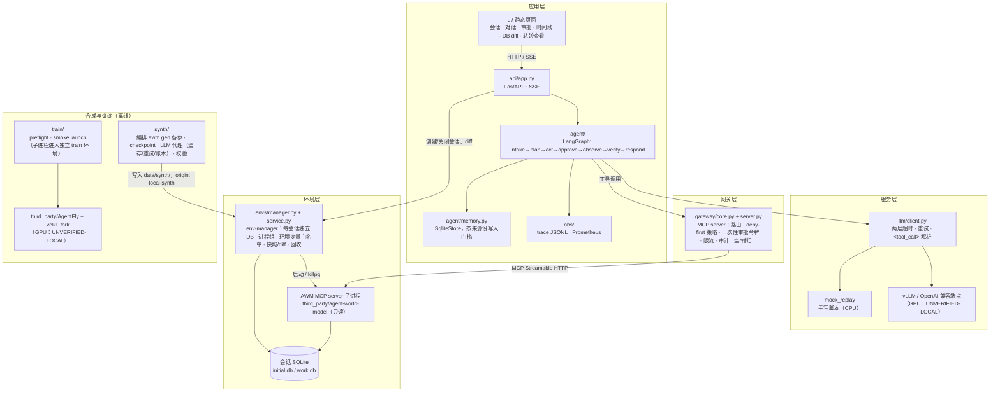
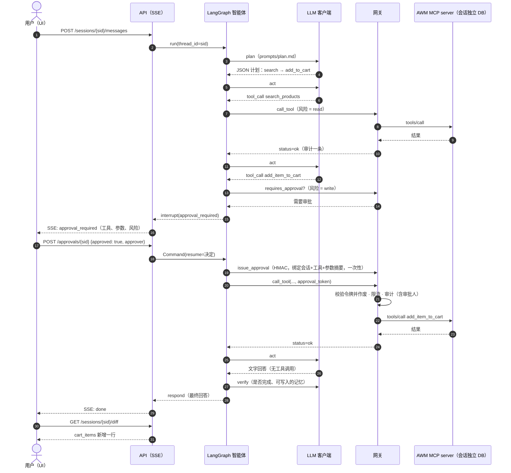
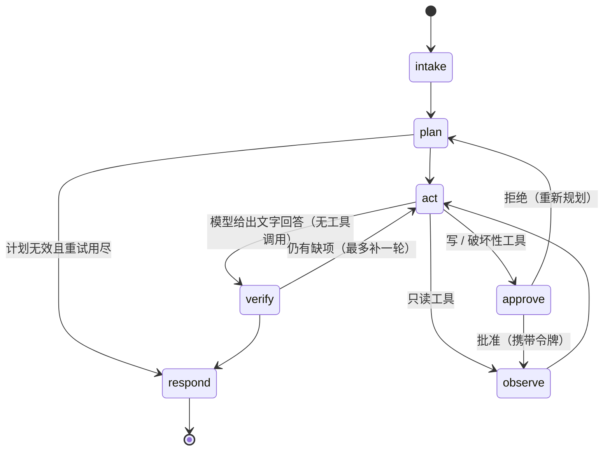

# ARCHITECTURE — 分层结构与关键时序

本仓库只做应用层与工程层：把上游 AWM 的环境、上游 AgentFly 的训练框架，组织成一个"可部署、可审计、可演示"的企业 MCP 智能体工作台。模型本身和评测都不在范围内（ADR-013）。

## 1. 分层图

说明：

- 外部 MCP 客户端也可以直接连接网关（API 内挂载在 `/gateway/mcp`，或 `workbench gateway serve` 独立运行），享有同样的策略与审计（ADR-005）。
- env-manager 可以与 API 同进程（`LocalEnvService`），也可以作为独立服务（`workbench env serve` + `RemoteEnvService`），docker compose 使用后者。
- app 环境与 train 环境是两个独立的 uv 环境；app 代码不 import 任何训练依赖（ADR-002，R11）。

## 2. 一次带审批的写操作

以 demo 场景为例："把 200 美元以内评分最高的无线降噪耳机加入购物车"。

要点：

- 被中断的 `approve` 节点在恢复时会重新执行，所以令牌在恢复后才签发（`agent/nodes/approve.py`）。
- 令牌与参数摘要绑定：模型在审批后改动参数，网关会拒绝调用。
- 拒绝时，智能体收到 `{"status": "rejected"}` 的工具消息并回到 `plan` 重新规划。
- 每一步都会写入 trace（`obs/tracing.py`）并通过 SSE 推给 UI；网关另写一份 JSONL 审计日志（PII 脱敏）。

## 3. 智能体状态机

守卫（`agent/guards.py`）：最大步数、重复调用、连续无变化、token 预算、墙钟时间。任一触发都进入 `respond`（`agent/nodes/common.py`），并在 trace 中记录 `terminated` 原因。长期记忆只在 `verify` 节点写入，且只接受 `user_stated` 与 `tool_result` 两种来源（ADR-010）。
